# AgentLens Architecture

AgentLens is a VS Code extension that receives OpenTelemetry (OTLP) telemetry from AI coding agents (GitHub Copilot, Claude Code, Codex), reads local session files and databases (including OpenCode's SQLite database), persists everything to a local SQLite database, summarises it into per-session cards, and visualises it in a sidebar and a full dashboard.

---

## Table of Contents

1. [System Overview](#1-system-overview)
2. [Extension Activation](#2-extension-activation)
3. [Data Ingestion Pipeline](#3-data-ingestion-pipeline)
4. [Local Log Ingestion](#4-local-log-ingestion)
5. [OTLP Collector](#5-otlp-collector)
6. [Session Summarizer](#6-session-summarizer)
7. [Per-Agent Summarizers](#7-per-agent-summarizers)
8. [SQLite Storage Layer](#8-sqlite-storage-layer)
9. [Session Data Model](#9-session-data-model)
10. [Frontend Architecture](#10-frontend-architecture)
11. [Cost Calculation](#11-cost-calculation)
12. [Auto-Configuration](#12-auto-configuration)
13. [Build Pipeline](#13-build-pipeline)

---

## 1. System Overview

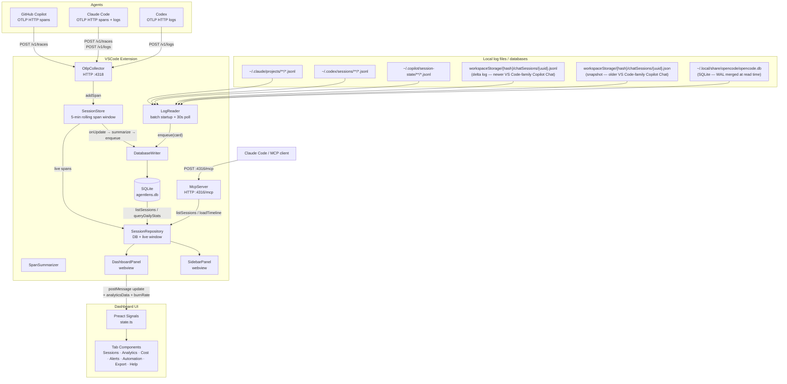

---

## 2. Extension Activation

> **Historical (pre-fork).** The VS Code extension host was removed before the fork
> (TRDD-6E6416B8): there is no `src/extension.ts` and no `vscode` dependency. The
> persistence modules this sequence wires up (`src/database/*`, `sessionRepository.ts`)
> are retained in-tree per the TRDD KEEP inventory but are exercised only by the unit
> tests, through the structural stand-ins in `src/vscodeCompat.ts`. The shipped runtime
> boots via `standalone/server.ts` and persists through the segmented span store
> (section 5) plus `~/.agentlens/forensics.db`. The sequence below is kept as the
> reference for the retained layer's original activation flow.

The extension activated in a fixed sequence.

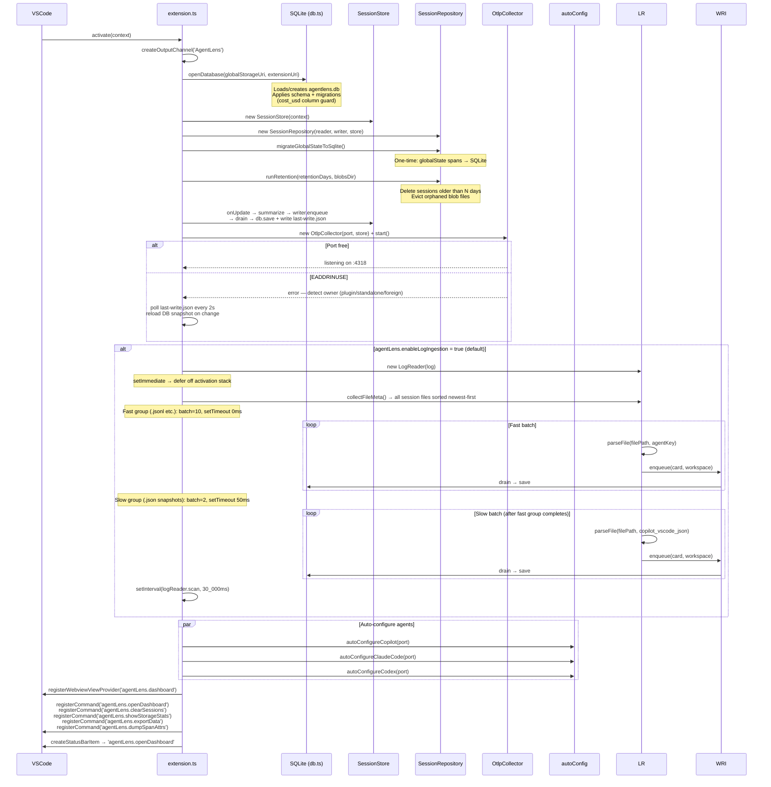

---

## 3. Data Ingestion Pipeline

There are two independent ingestion paths: OTLP (network) and local log files (disk). Both converge at `DatabaseWriter`.

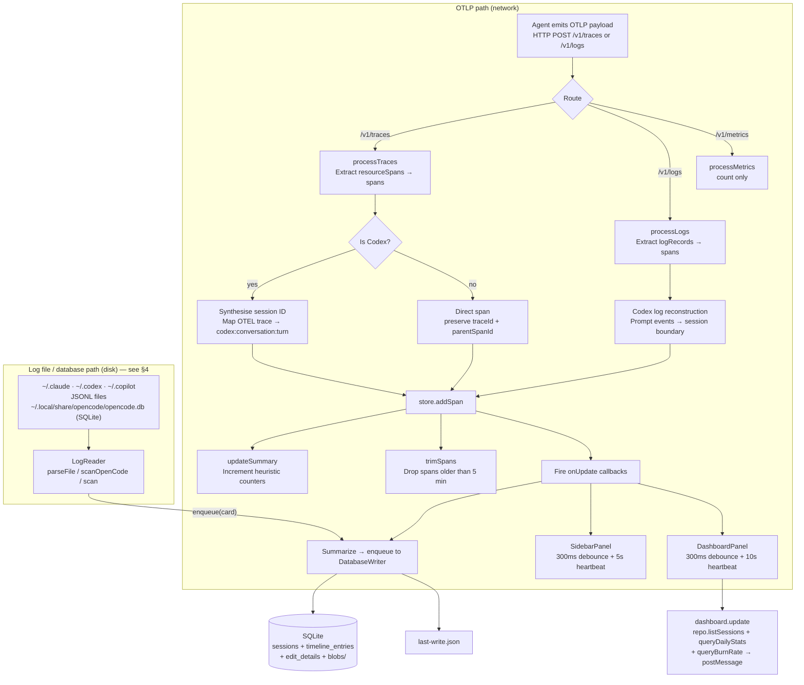

---

## 4. Local Log Ingestion

A parallel, network-free ingestion path that reads session files written to disk by each agent. Implemented in `src/logReader.ts` (`LogReader` class).

### File locations

| Agent | Format | Default path | Env override |
| --- | --- | --- | --- |
| Claude Code | JSONL (append log) | `~/.claude/projects/<project>/<uuid>.jsonl` | `CLAUDE_CONFIG_DIR` (comma-separated config dirs) |
| Codex | JSONL (append log) | `~/.codex/sessions/<project>/<uuid>.jsonl` | `CODEX_HOME` (comma-separated home dirs) |
| Copilot CLI | JSONL (event log) | `~/.copilot/session-state/<uuid>/events.jsonl` | — (written automatically) |
| Copilot Chat (VS Code-family, newer) | JSONL (delta log) | `workspaceStorage/<hash>/chatSessions/<uuid>.jsonl` | — |
| Copilot Chat (VS Code-family, older) | JSON (snapshot) | `workspaceStorage/<hash>/chatSessions/<uuid>.json` | — |
| OpenCode | SQLite database (WAL mode) | `~/.local/share/opencode/opencode.db` (Linux/Mac) | `OPENCODE_DATA_DIR` (comma-separated data dirs) |

`workspaceStorage` is at `~/Library/Application Support/<IDE>/User/workspaceStorage` (macOS), `%APPDATA%\<IDE>\User\workspaceStorage` (Windows), or `$XDG_CONFIG_HOME/<IDE>/User/workspaceStorage` (Linux), where `<IDE>` is any VS Code-family IDE. AgentLens scans all known VS Code-family IDEs automatically — VS Code, VS Code Insiders, Cursor, Windsurf, VSCodium, Trae, and Kiro — via `VSCODE_FAMILY_IDE_NAMES` in `src/vscodeFamilyIdes.ts`. Standalone auto-config writes Copilot settings into every installed IDE's `settings.json`. Windows: Claude Code also checks `%APPDATA%\Claude\projects`. Linux/Mac: `XDG_CONFIG_HOME` is also checked for Claude.

### Copilot Chat — delta log format (`.jsonl`)

VS Code writes one JSONL per session where each line is an operation on the session state object:

| `kind` | Meaning |
| --- | --- |
| `0` | Initial session snapshot (`creationDate`, `sessionId`, `inputState.selectedModel`) |
| `1` | Set — `k` is key path, `v` is new value (e.g. `["requests", N, "completionTokens"]`) |
| `2` | Push — `k` is key path, `v` is array of items to append |

New turn: `kind=2` with `k=["requests"]` (exactly one element). Response sub-arrays (`k=["requests", N, "response"]`) are ignored. `completionTokens` arrives via kind=1 (streaming final) and optionally embedded in the kind=2 request push object (Format B); kind=1 always wins.

### Copilot Chat — snapshot format (`.json`)

Older VS Code Copilot Chat versions wrote the full session state as a single JSON object. The `requests` array contains all turns with `message.text`, `timestamp`, `modelId`, and tool call data. No token counts are stored. Only collected when no `.jsonl` sibling exists for the same session UUID.

### OpenCode — SQLite database

OpenCode stores all session data in a local SQLite database (`opencode.db`) using WAL (Write-Ahead Log) mode. AgentLens reads the database directly using `sql.js` (WASM SQLite), merging the WAL file at read time so in-progress sessions are visible immediately.

**WAL merge:** `opencode.db-wal` can be larger than the main database file when sessions are active. `_mergeWal()` parses the 32-byte WAL header (magic, page size, salt pair), iterates frames of size `24 + pageSize`, applies frames whose salt matches the database header, and returns a merged in-memory buffer for `sql.js` to open. The WAL mtime is checked alongside the database mtime so new sessions trigger a rescan.

**Three-query parse:** `_parseOpenCodeDb()` executes three queries in one pass:

1. **Session query** — `session` table: `id, title, directory, model, time_created, tokens_input, tokens_output, tokens_cache_read, tokens_cache_write`. Filters: `parent_id` null/empty (skip sub-sessions), total tokens > 0. Model is stored as JSON (`{"id":"...", "providerID":"..."}`); the `id` field is extracted.
2. **Message query** — `message` table joined on `session_id`: per-assistant-turn timing (`time.created`, `time.completed` from the `data` JSON) and token counts.
3. **Part query** — `part` table joined with `message`: `type` (text / tool / step-start / step-finish / reasoning), `text`, `tool_name`, `callID`, `tool_input_json`, `tool_output`, `tool_status`, and timestamps. Results are grouped per session into `partsBySess` for card building.

**User request:** The last `text`-type part with `role=user` is used as `userRequest` (not the first) to capture the most recent user message in multi-turn sessions.

**Timeline:** `llmEvents` (one per assistant message, from the message query) and `toolEvents` (one per tool part, from the part query) are merged and sorted by timestamp into `TimelineEntry[]`.

### Scan mechanics

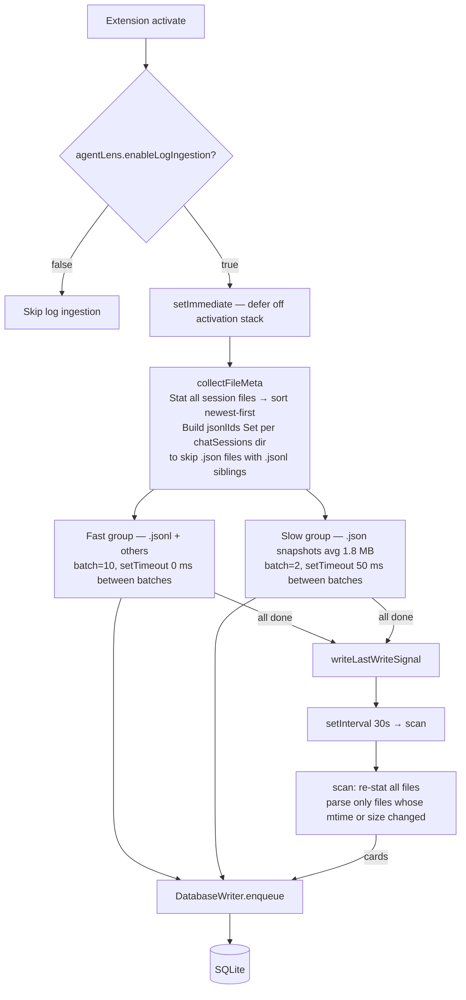

**Incremental reads:** `_readNewLines` / `_readJsonFile` track `{ bytesRead, mtimeMs }` per file in a `Map<string, FileState>`. On each poll only files whose mtime or size has changed are re-parsed — the whole file is re-read each time (not byte-offset) to produce a complete card. `fileState` is not persisted to disk; on extension restart all files are re-scanned once.

**Two-phase startup loading:** the fast group (all non-.json files) runs first and surfaces recent sessions immediately. The slow group (legacy .json snapshots) starts after the fast group finishes, with a 50 ms gap between each 2-file batch to keep the extension host responsive (each ~60 ms parsing window).

### Data availability

| Field | OTLP | Claude / Codex logs | Copilot CLI log | Copilot Chat JSONL | Copilot Chat JSON | OpenCode SQLite |
| --- | --- | --- | --- | --- | --- | --- |
| Session ID, workspace | ✓ | ✓ | ✓ | ✓ | ✓ | ✓ |
| Model | ✓ | ✓ | ✓ | ✓ (initial model only) | ✓ (first request) | ✓ |
| Timestamps, duration | ✓ | ✓ | ✓ | ✓ | ✓ | ✓ |
| Input tokens | ✓ | ✓ | ✓ (from `session.shutdown`) | ✗ not stored | ✗ not stored | ✓ |
| Output tokens | ✓ | ✓ | ✓ | ✓ (`completionTokens` per turn) | ✗ not stored | ✓ |
| Cache read / write tokens | ✓ | ✓ | ✓ (from `session.shutdown`) | ✗ not stored | ✗ not stored | ✓ |
| User request text | ✓ | ✓ | ✓ | ✓ | ✓ | ✓ (last user message) |
| Tool calls (names) | ✓ | ✓ | ✓ | ✗ | ✗ (presence only) | ✓ |
| Tool call inputs / outputs | ✓ | ✓ | ✗ | ✗ | ✗ | ✓ |
| File paths from tools | ✓ | ✓ | ✓ | ✗ | ✗ | ✓ |
| TTFT, per-tool timing | ✓ | ✗ | ✗ | ✗ | ✗ | ✗ |
| Streaming speed, loop signals | ✓ | ✗ | ✗ | ✗ | ✗ | ✗ |
| Full turn timeline | ✓ | ✓ | ✗ | ✗ | ✗ | ✓ (LLM + tool entries) |

Sessions produced by `LogReader` carry `dataSource: 'log'` on `SessionSummaryCard`; OTLP sessions carry `dataSource: 'otel'`. The UI shows an OTEL/Log source badge on each session row.

When both feeds capture the same session (same sessionId — for Claude the OTEL summarizer keys cards by the transcript UUID carried in the `session.id` span attribute), the winner is decided by `src/feedMergePolicy.ts`: **for Claude sessions the log transcript wins on collision (OTEL is a lossy lower bound — collector-downtime loss plus the rolling summarization window; before the segmented span store, `MAX_SPANS` eviction was a third, since-removed loss mechanism); OTEL wins only where no transcript exists.** Every other source keeps the original OTEL-wins rule.

**Provenance stamps (P7).** The merge decision is recorded on the card itself: `feedMergePolicy.ts` stamps `tokensSource: 'log' | 'otel' | 'merged'` (which feed backs the served token/cost figures) and, on the outcomes that displaced or absorbed a twin, a human-readable `coverageNote` (e.g. the log-wins note that the colliding OTEL card was displaced). Stamps are applied at the decision points — the standalone merge, the repository merge/dedup, and identity-dedup absorption — so the provenance always matches the doctrine that picked the numbers, and they are re-stamped on every merge pass (self-correcting, never stale). A `null` `tokensSource` means a pre-P7 card: rendered as "unknown", never guessed.

### Bypasses SessionStore / SpanSummarizer

`LogReader` produces `SessionSummaryCard` objects directly (via `_buildCard`) and writes them straight to `DatabaseWriter`. The OTLP path's `SessionStore` and `SpanSummarizer` are not involved.

---

## 5. OTLP Collector

A minimal HTTP/1.1 server (Node `http` module) that handles three routes and maintains stateful session reconstruction for Codex.

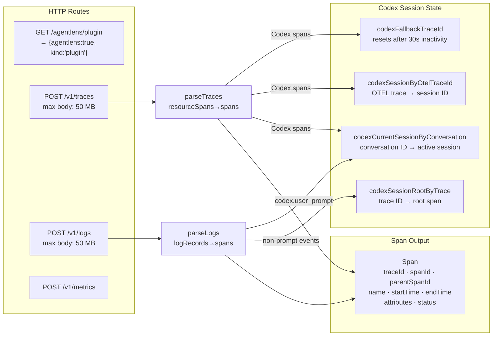

**Key non-obvious behaviour:** Codex session IDs (`codex:{conversationId}:prompt-N`, an ordinal per prompt cycle, or `codex:{conversationId}:{turnId}` when a turn id is present) are assigned on arrival. Once set, the mapping is immutable even if spans arrive out of order or are retried.

This per-prompt grouping lives **once** in `src/codexSessionNormalizer.ts` (`CodexSessionNormalizer` — it owns `codexSessionByOtelTraceId`, `codexCurrentSessionByConversation`, the per-conversation prompt ordinal, and the resolve logic). All three OTLP-log ingest paths share it: `otlpParser.parseLogPayload` constructs one per call (state scoped to a payload), while `OtlpCollector` and the standalone server's `processLogs` each hold one long-lived instance so the grouping persists across payloads. Before this consolidation the shipped standalone path had drifted to group Codex by conversation id alone. The downstream summarizer (`summarizers/codex.ts` `groupCodexSpansBySession`) independently re-derives the same per-prompt grouping from stored spans, so it is the store key, not the summarized view, that this normalizer keeps consistent.

**gen_ai response content (Codex/OpenAI).** The `gen_ai_latest_experimental` instrumentation does not put the assistant's reply on the LLM span — it emits it as a separate `gen_ai.choice` / `gen_ai.assistant.message` **log event** correlated to the span by `traceId:spanId`, arriving on a different request either before or after the span. `processLogs` formats that event (shared `src/genAiContent.ts` `formatGenAiEventContent` → the `gen_ai.output.messages` shape `extractResponseText` reads) and calls `SegmentedSpanStore.injectSpanAttribute(traceId, spanId, 'gen_ai.output.messages', …)`. That is a **read-time overlay**: the store records the attribute in an in-memory `Map<traceId:spanId, {key:value}>` and merges it into the span when the span is next read via `loadRange` — so ordering does not matter and no persisted NDJSON segment is ever rewritten. The overlay is cap-evicted (oldest-first, 500) and in-memory only (rebuilt from live events, not persisted across restart).

### Standalone span store — segmented, append-only, no eviction

The standalone server persists every received span through `src/segmentedSpanStore.ts`:

```text
~/.agentlens/spans/
├── 2026-07-09.ndjson    # one JSON span per line, bucketed by UTC receive day
├── 2026-07-10.ndjson
└── index.json           # per-segment {count, minTs, maxTs, bytes} — atomic write, self-healing
```

- **Append is O(record).** Spans buffer in memory and the 5-second flush tick appends one chunk per touched segment. A segment file is **never rewritten** — the previous single-file store's rewrite pattern destroyed 420GB of SSD in 4.4 hours, and its shutdown rewrite was the last survivor of that pattern.
- **No span-count cap, no eviction.** The previous store capped at `MAX_SPANS=50,000` and was measured losing 1,700 spans in a single restart (`Loaded 50000 spans (capped from 51700)`). The segmented store keeps everything until retention expires the whole segment.
- **Memory is a time window, not the store.** The in-memory `spans` array holds only the rolling summarization window (`AGENTLENS_SUMMARY_WINDOW_HOURS`, default 24h; under heap pressure it halves down to a 5-minute floor, logged loudly). Boot and any range query load **only the segments overlapping the requested time range** via `loadRange()` — never the whole store.
- **Retention deletes whole expired segments only** (`AGENTLENS_SPANS_RETENTION_DAYS`, default 30), on boot + daily, one explicit log line per deletion: `retention: deleted segment 2026-06-01.ndjson, N spans, age 39d`. Nothing is ever dropped silently.
- **Retention is persistently configurable** (`src/retentionConfig.ts`, TRDD-ZAV74M8Q). The five retention knobs (spans/summary/bodies) resolve at boot with the precedence **env var > `DATA_DIR/config.json` > built-in default**, each min-floored. `config.json` lives in `DATA_DIR`, so a value set once survives an uninstall/upgrade/CLI-path-change and the always-on daemon (which a shell `export` can't reach) re-reads it every boot. `agentlenspro config [list|get|set]` inspects/persists them; a `set` on a corrupt config file refuses to write rather than clobbering it. A single `RETENTION_META` table is the source of truth both the server and the CLI read.
- **One-time migration.** The first boot splits a legacy `spans.json` (NDJSON or the older whole-array format) into daily segments and renames it to `spans.json.bak` — preserved, never deleted.
- **No native dependencies** (deliberate): better-sqlite3 would give indexed queries but breaks `npx` portability; plain NDJSON + a JSON index stays pure-Node and greppable.

### Always-on, no-loss ingestion + admission control (D3K7QM2P)

Ingestion must keep going whenever any Claude instance is active, lose nothing, and survive 20+
instances (plus subagents) hammering the CLI at once. This is achieved WITHOUT a two-process split —
the ingestion daemon **is** the standalone server, kept always-on by the hooks themselves:

- **JSONL is already loss-less.** Claude/Codex/Copilot write their transcripts to disk themselves;
  `LogReader.scan()` tails them with persisted byte offsets and backfills everything on restart. The
  server being down never loses a transcript.
- **Hook durability (`src/cli/hookHandlers.ts`).** A hook event that can't be delivered — server down,
  or shed under load — is appended to `~/.agentlens/hook-spool/` and a **detached, stampede-locked**
  server revive is fired (`.daemon-revive.lock`, the pidfile guard as backstop). The server drains the
  spool through the same `/api/hook-events` ingest path on boot and on a slow tick, so nothing is lost
  across the revive window. The spool is bounded (oldest-dropped) so a permanently-down server can't
  fill the disk. `AGENTLENS_NO_REVIVE=1` is a spool-only mode for externally-supervised setups.
- **`agentlenspro daemon`** names this role (start/stop/restart/status/install/uninstall); `status`
  shows the spool depth, `install` writes a launchd agent for 24/7 supervision (opt-in).
- **Admission control (`src/resourceMonitor.ts` + `src/admissionController.ts`).** Both HTTP servers
  share one resource monitor (RSS, per-core load, free disk — TTL-cached) and one bounded-concurrency
  controller. Under load it queues overflow briefly (bounded + deadlined, never blocking a caller
  unbounded) and sheds `503 + Retry-After` only at a hard wall. **Shedding is loss-free**: a shed hook
  spools (above), a shed OTLP export is retried by the exporter / backfilled by the next scan, and a
  shed agent-gate fails open (never blocks a launch). `/events` (SSE), `/api/server-stats`, and the
  hook-config kill-switch read are exempt so health + control always answer under load. Limits are
  env-tunable (`AGENTLENS_MAX_INFLIGHT*`, `AGENTLENS_MAX_RSS_MB`, `AGENTLENS_MIN_FREE_DISK_MB`,
  `AGENTLENS_LOADAVG_MAX`, `AGENTLENS_ADMIT_*`) and CPU-scaled; live counters ride `/api/server-stats`.

### Body store — content-addressed, verify-then-delete (TRDD-K3WDPR7M)

Raw OTEL request/response bodies (opt-in capture — `src/captureConfig.ts`,
`agentlenspro config set captureRawBodies on|off`) no longer accumulate as loose JSON files or
feed a gzip archiver. They are ingested into a **content-addressed body store** at
`<dataDir>/store/` (`src/store/db.ts`, `bodyStore.ts`, `ingestPass.ts`):

```text
Claude Code raw body write
  → live bodies dir (plain files: DATA_DIR/otel-bodies, or the RAM-disk spool when capture is on)
  → ingestPass(): sectionize the body into literal + shared-span parts (src/store/sections.ts),
    hash each span (its content IS its address), write new spans + body/part metadata into an
    IN-MEMORY DuckDB instance — never a persistent .duckdb file (see below)
  → flush(): the in-memory tables are written ONCE to immutable, zstd-compressed Parquet parts
    under store/{blobs,bodies,parts}/ and never rewritten
  → VERIFY: reconstructBody() re-reads the body from the flushed, DURABLE Parquet parts and
    compares its sha256 against the original file's bytes
  → only on a proven byte-identical match is the source file deleted
```

**Why fileless DuckDB.** A *persistent* `.duckdb` file rewrites row-groups internally — measured
at 5 MB of device writes for a single 881 KB turn (300× worse than the alternative below). Running
DuckDB `:memory:` and flushing to Parquet parts that are written once and never rewritten avoids
that amplification entirely; `temp_directory` is set to `''` so an over-limit query fails loudly
instead of silently spilling to the SSD mid-query.

**Deduplication.** Because consecutive turns re-send most of the same transcript, spans are
deduplicated by content hash across the whole store (`Store.known`, reloaded from the durable
Parquet parts on boot) — re-ingesting a body that shares spans with an earlier one adds zero new
bytes for those spans. This is most of where the size reduction below comes from, not compression
alone.

**RAM-disk spool (opt-in capture only, macOS).** When raw-body capture is on, the *write itself*
is the SSD wear the store cannot avoid downstream, so `src/ramdisk.ts` mounts a RAM-disk volume
(`AgentLensSpool`) and Claude Code's `OTEL_LOG_RAW_API_BODIES` is pointed at it instead of a real
path — the live bodies dir the pipeline above drains is then volatile memory, not disk. A
boot-time LaunchAgent (`agentlenspro spool ensure`, `src/cli/spoolLaunchAgent.ts`) re-creates the
spool at login, since a reboot destroys the RAM disk but Claude Code reads the env var only at
launch; the drain runs every 60s in spool mode (vs. hourly otherwise) with an emergency cap so a
runaway producer cannot fill volatile memory.

**Legacy `.wad` archive — read-only fallback, not the current write path.** Before this store, an
hourly archiver pass gzip-packed each body into a monthly `.wad` volume (`src/bodyArchive.ts`)
with no cross-body dedup — the identical ~268 KB `tools` array was stored again every single turn.
That archiving behavior is retired (the same periodic pass now ingests into the content-addressed
store instead), but existing `.wad` volumes are **never deleted automatically** — reclaiming them
is a separate, explicit decision — and remain readable: `src/store/migrateArchive.ts` drains a
`.wad` volume into the content-addressed store the same verify-then-delete way, and
`/api/bodies/export` (`exportBodiesFromStore` in `src/store/bodyStore.ts`) reads from **both** the
store and the `.wad` archive so an export never silently misses a body that has already been
reclaimed from the live directory.

Measured on this project's own captured history: ~52 GB of raw bodies (live capture plus the
drained legacy archive) compressed to ~270 MB of Parquet on disk (~190×), with every body verified
byte-identical at ingest time — full-corpus validation was still in progress at the time of
writing (`reports/storage-migration/20260715_003054+0200-backfill-and-drain.md`). A smaller,
independently-run dry run separately measured 167× (4.00 GB → 24 MB, 7,439/7,439 bodies
verified).

### Delta-log persistence for session/offset state (TRDD-K3WDPR7M)

`log-sessions.json` and `log-offsets.json` were previously rewritten **in full** on every save —
measured at ~9.4 MB/min of device writes combined, regardless of how many records actually
changed. `src/store/deltaLog.ts`'s `DeltaLog<T>` replaces the whole-file rewrite with a
`<name>.snapshot.ndjson` + `<name>.delta.ndjson` pair: each save hashes every record's serialized
form and appends **only** the records that changed (plus tombstones for records that disappeared)
to the delta file — a save where nothing changed now writes zero bytes. The delta log is
periodically compacted back into a fresh snapshot once it grows past the snapshot's own size
(bounding replay cost on load), and a crash mid-append can only lose a torn trailing line, which
`load()` drops on the next read — the record it belonged to is simply re-derived and re-appended
on the next save.

---

## 6. Session Summarizer

`summarizeSpans()` is called on the live rolling span window (last 5 minutes). It groups raw spans into agent-session cards and computes cross-session efficiency metrics. Historical sessions are read directly from SQLite; the two sources are merged by `SessionRepository`.

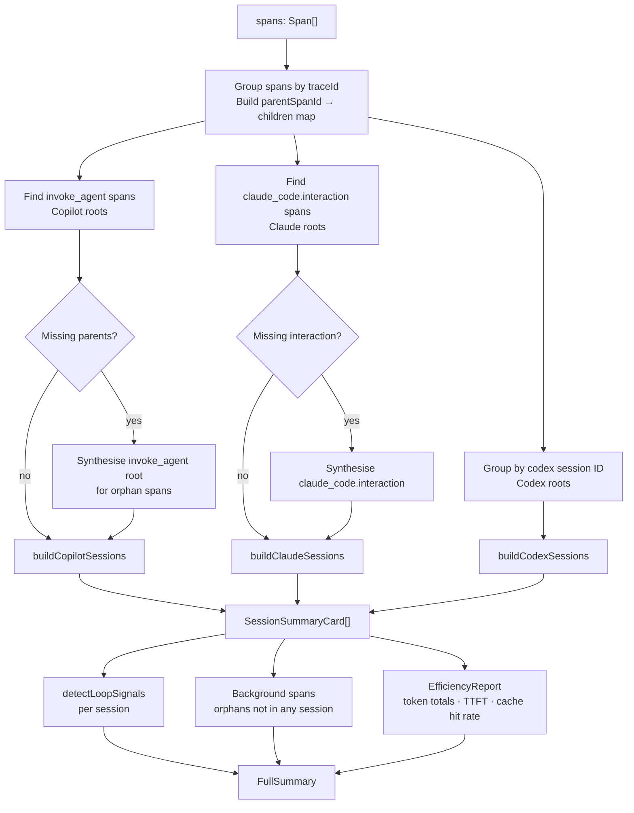

---

## 7. Per-Agent Summarizers

Each agent uses a different span structure. The summarizers normalise these into a common `SessionSummaryCard`.

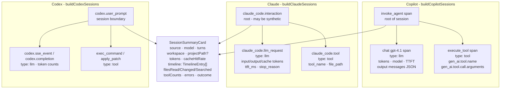

---

## 8. SQLite Storage Layer

Introduced in phases 1–4. The database is the authoritative source for all historical session data. The live 5-minute span window supplements it for in-progress sessions.

### Schema

```mermaid
erDiagram
    sessions {
        TEXT session_id PK
        TEXT trace_id
        TEXT source
        TEXT workspace
        TEXT project_path
        TEXT model
        INTEGER start_time
        INTEGER duration_ms
        INTEGER turns
        INTEGER input_tokens
        INTEGER output_tokens
        INTEGER cache_read_tokens
        INTEGER cache_create_tokens
        REAL cache_hit_rate
        INTEGER total_tool_calls
        INTEGER total_llm_calls
        INTEGER errors
        TEXT outcome
        INTEGER is_sidechain
        TEXT user_request
        TEXT tool_counts
        TEXT loop_signals
        TEXT files_read
        TEXT files_changed
        TEXT files_searched
        REAL cost_usd
    }
    timeline_entries {
        INTEGER id PK
        TEXT session_id FK
        TEXT span_id
        INTEGER position
        TEXT type
        TEXT label
        TEXT model
        INTEGER input_tokens
        INTEGER output_tokens
        INTEGER ttft
        INTEGER duration_ms
        TEXT action
        TEXT decision
        INTEGER is_error
        TEXT error_message
        TEXT timestamp
        INTEGER has_blob
    }
    edit_details {
        INTEGER id PK
        INTEGER timeline_entry_id FK
        TEXT file_path
        TEXT tool_name
        INTEGER has_blob
    }
    sessions ||--o{ timeline_entries : "has"
    timeline_entries ||--o{ edit_details : "has"
```

Large string fields (`responseText`, `thinking`, `toolInput`, `fullResult`, `oldString`, `newString`) above 512 bytes are stored as files at `globalStorageUri/blobs/<spanId>-<field>.txt` rather than inline in the DB. The `has_blob` flag indicates when to read from disk instead.

### Component responsibilities

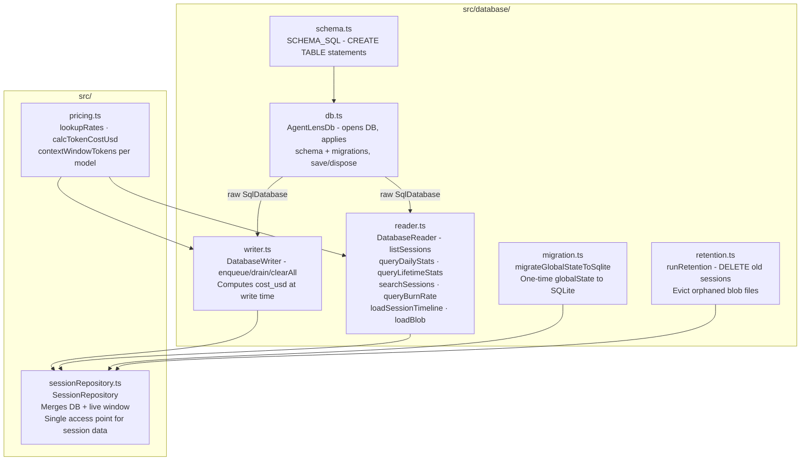

### Data flow: write path

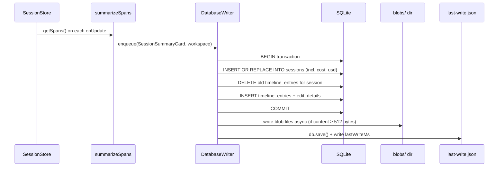

### Data flow: read path

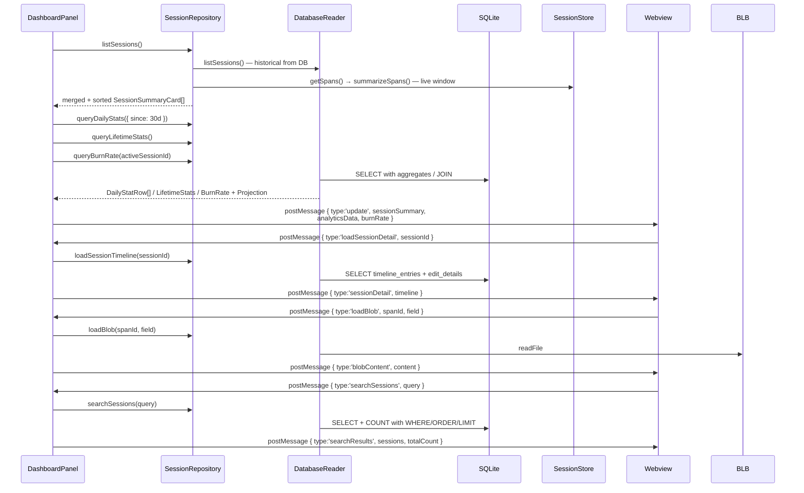

### Cross-window sync

When two VS Code windows are open and one holds the OTLP collector (port 4318), the other cannot collect spans. The non-collector window polls `last-write.json` every 2 seconds and reloads a fresh DB snapshot via `openReadonlySnapshot()` when the timestamp advances.

### Storage management

`agentLens.sessionRetentionDays` (default 90) controls how long sessions are kept. `runRetention` is called at activation and every 24 hours. After deleting old rows it scans `blobs/` and removes any file whose span ID is no longer in `timeline_entries`.

`agentLens.showStorageStats` reports DB file size, blob directory size, session count, and date range to the Output channel.

---

## 9. Session Data Model

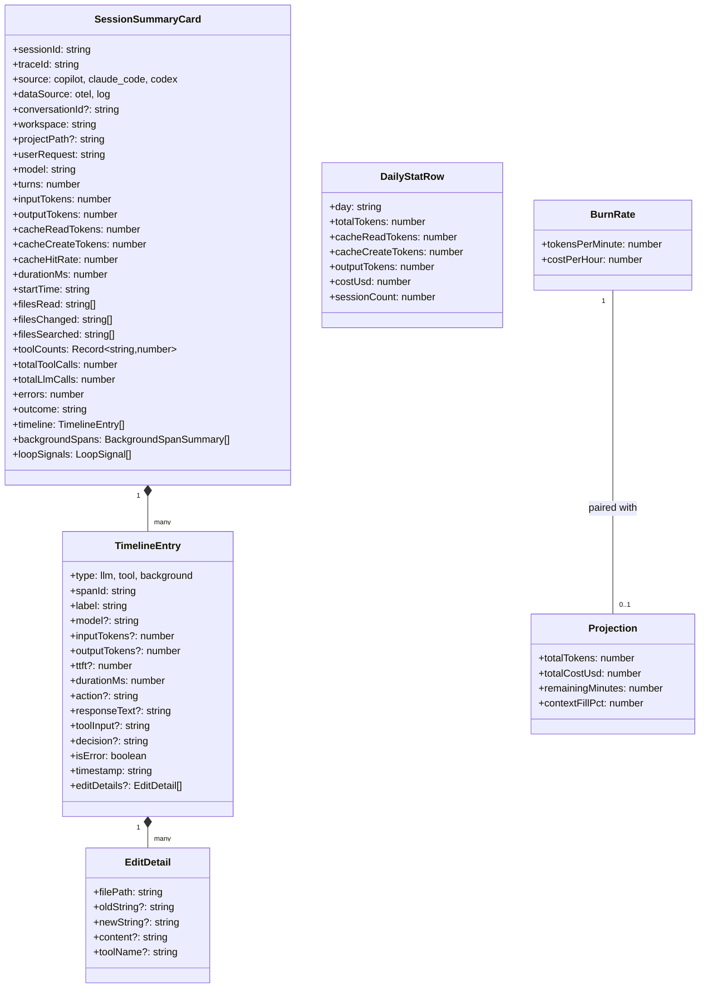

**Lazy timeline loading:** `SessionSummaryCard.timeline` is always `[]` when read from SQLite. The webview requests individual timelines on demand via `loadSessionDetail`. Blob fields (`responseText`, `thinking`, etc.) are further deferred until the user expands an entry (`loadBlob`).

---

## 10. Frontend Architecture

The dashboard is a Preact application bundled into `media/dashboard.js`. It uses `@preact/signals` for reactive state — no Redux, no Context, no prop drilling.

### Signal graph

```mermaid
graph TD
    subgraph coredata["Core data - set by DashboardPanel"]
        SIG_SUM[sessionSummary<br/>FullSummary or null]
        SIG_TOOLS[toolCalls<br/>Record of string to number]
        SIG_TL[sessionTimelines<br/>sessionId to TimelineEntry array]
        SIG_BLOB[blobCache<br/>spanId:field to string]
        SIG_DS[dailyStats<br/>DailyStatRow array]
        SIG_LS[lifetimeStats<br/>LifetimeStats or null]
        SIG_BR[burnRateData<br/>BurnRateData or null]
        SIG_SR[searchResults<br/>SearchResultData or null]
        SIG_RSR[rangedSearchResults<br/>DB results for active time range]
    end

    subgraph uicontrols["UI controls"]
        SIG_LIM[sessionLimit<br/>number, default 10]
        SIG_AGT[selectedAgentFilter<br/>AgentFilter, default all]
        SIG_WS[workspaceFilter<br/>WorkspaceFilter, default all]
        SIG_TAB[activeTab<br/>string, default sessions]
        SIG_TF[sessionTextFilter<br/>string]
        SIG_SK[sessionSortKey<br/>start_time · total_tokens · duration_ms<br/>errors · prompt · model · source · cost]
        SIG_SD[sessionSortDir<br/>asc or desc]
        SIG_TR[timeRange<br/>preset + optional since/until]
        SIG_INF[insightFilter<br/>all · loop · efficiency]
        SIG_IGN[ignoredInsightKeys<br/>Set of string]
    end

    subgraph Computed
        COMP_AF[agentFilteredSessions<br/>computed — filter by source + workspace]
        COMP_AWS[availableWorkspaces<br/>computed — unique workspace paths]
        COMP_DISP[displaySessions<br/>computed — last N sessions]
        COMP_RS[rangedSessions<br/>computed — time range + DB merge]
        COMP_FS[filteredSessions<br/>computed — text filter + sort]
        COMP_PRES[agentPresence<br/>computed — which agents active]
    end

    SIG_SUM --> COMP_AF
    SIG_AGT --> COMP_AF
    SIG_WS --> COMP_AF
    SIG_SUM --> COMP_AWS
    COMP_AF --> COMP_DISP
    SIG_LIM --> COMP_DISP
    COMP_AF --> COMP_RS
    SIG_TR --> COMP_RS
    SIG_RSR --> COMP_RS
    COMP_RS --> COMP_FS
    SIG_TF --> COMP_FS
    SIG_SK --> COMP_FS
    SIG_SD --> COMP_FS
    COMP_RS --> COMP_PRES

    COMP_FS --> TAB_COMPS[Tab components]
    COMP_DISP --> TAB_COMPS
    SIG_TL --> TAB_COMPS
    SIG_BLOB --> TAB_COMPS
    SIG_DS --> TAB_COMPS
    SIG_LS --> TAB_COMPS
    SIG_BR --> TAB_COMPS
    SIG_SR --> TAB_COMPS
    SIG_TAB --> TAB_COMPS
```

**Key computed signal semantics:**

- `agentFilteredSessions` — all in-memory sessions filtered by agent pill, data source, and workspace dropdown. No limit applied. This is the root filter — all downstream computeds derive from it, so the workspace filter automatically scopes every tab.
- `availableWorkspaces` — sorted list of unique workspace paths from all loaded sessions. Drives the workspace dropdown options.
- `displaySessions` — `agentFilteredSessions` sliced to `sessionLimit` (most recent N). Used for the Sessions table.
- `rangedSessions` — for bounded presets (7d/30d/…): merges `rangedSearchResults` (DB) with in-memory sessions that fall in the window. For "All": returns `agentFilteredSessions` directly.
- `filteredSessions` — `rangedSessions` with text filter and sort applied. Used by Sessions table, Insights, and Efficiency charts within Analytics. Analytics charts that must stay time-ordered (ESTIMATED COST, TOKEN USAGE PER SESSION, CONTEXT GROWTH) source from `rangedSessions` directly.

**Workspace field flow:** `workspace` is stored in the `sessions` SQLite table (always present, `NOT NULL`). `project_path` is an optional secondary path some OTEL exporters populate. Both are mapped by `DatabaseReader.listSessions` into `SessionSummaryCard`. For OTEL-sourced sessions, `workspace` is stamped onto the card by `DatabaseWriter.enqueue` (the summarizers produce `workspace: ''` as a placeholder). For log-sourced sessions, `_buildCard` receives and records the workspace at parse time.

### Tab component overview

Six flat top-level tabs; secondary views are sub-panels within the expanded session row or the Analytics layout.

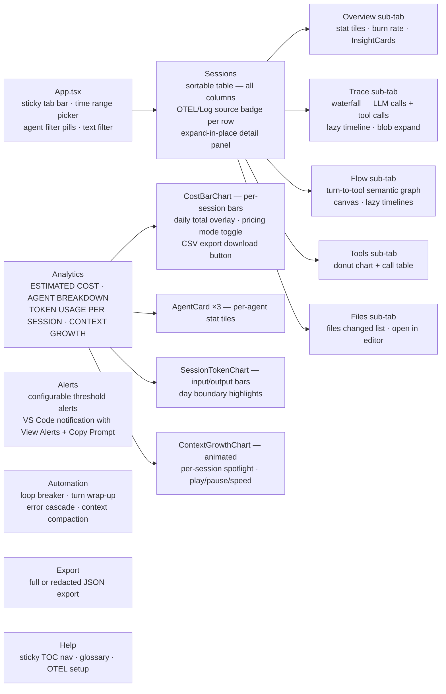

**Chart data isolation:** Analytics charts (`CostBarChart`, `SessionTokenChart`, `ContextGrowthChart`) source from `rangedSessions` (always newest-first by time) so the Sessions table sort key has no effect on their order.

### DashboardPanel ↔ Webview message protocol

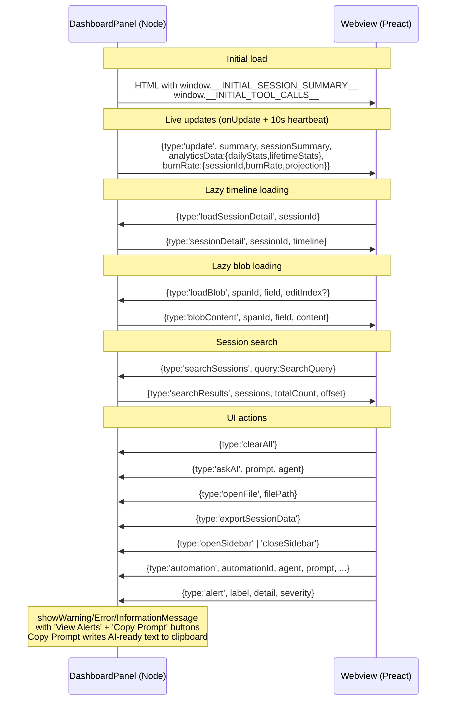

### Copy-branch export (⧉ tree) + `/api/branch-dump`

The Sessions detail section bar, each sub-agent branch (`SubAgentBranch`), and the Flow view carry a
`CopyBranchButton` (`media/src/CopyBranchButton.tsx`) that serializes a whole branch to a
self-describing text tree via the runtime-neutral `src/shared/branchSerialize.ts` (the same pure
module the mocha suite tests — one source of truth, imported by the webview). It materializes lazy
descendants with the existing `loadSessionDetail` / `loadBlob` messages, stamps a session-id +
project-slug header and a per-node OTEL match key `⟨span=… req=… trace=…⟩`, and offloads any body over
~8 KB to `POST /api/branch-dump` — a localhost-only writer confined to
`~/.claude/projects/<slug>/agentlens-branch-dumps/` (the slug must name a real project dir;
single-segment filename; resolved-parent containment check; inherits the uiServer CSRF + admission
guards). If the endpoint is unavailable the button inlines an honest "omitted" marker so a copy never
fails.

---

## 11. Cost Calculation

ONE rate table — `src/shared/pricing.ts` — serves both runtimes (it replaced the two hand-synced
copies that used to live in `src/pricing.ts` and `media/src/pricing.ts` and had drifted apart):

1. **Host / standalone server** — at write time via `calcTokenCostUsd` (per-call, applies the >200K
   tiered surcharge); `cost_usd` is stored in the `sessions` row and used for all aggregate queries
   (`SUM(cost_usd)`, `queryDailyStats`, `queryBurnRate`).
2. **Browser** — at display time via `calcTokenCost` (flat rates over session totals — per-call sizes
   cannot be reconstructed there); per-turn cost shown in the Cost tab and Flow tooltip. Request-mode
   billing (`PricingMode` 'request' / 'request-annual') is computed in `media/src/sessionMetrics.ts`
   as `turns × multiplier × $0.04`, with the multipliers coming from the same shared `ModelRates`.

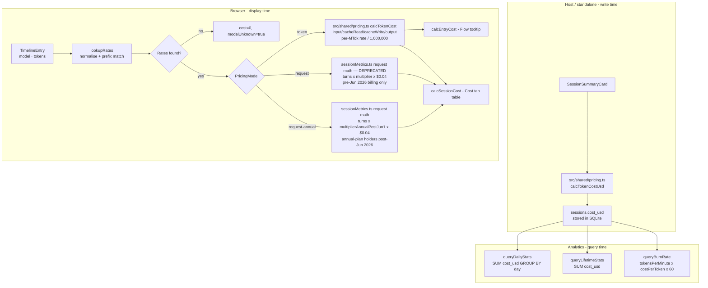

`contextWindowTokens` (stored in `src/shared/pricing.ts`) enables the `Projection` calculation: given current session token usage and burn rate, estimate time to context exhaustion and final cost.

Pricing data covers: OpenAI (GPT-4.1 through GPT-5.5), Anthropic (Claude Haiku/Sonnet/Opus 4.x), Google (Gemini 2.5–3.5), Codex, and fine-tuned models. Last updated: 2026-05-28.

### Keep-warm / cache-gap diagnostic (P6)

`src/shared/keepWarm.ts` (runtime-neutral — imported by the host and the webview) measures the cost of letting the Anthropic prompt cache expire between turns. The cache TTL is NOT a fixed 5 minutes — it is resolved per session from the regime matrix in `src/shared/cacheTtl.ts` (TRDD-VY1IUVUM): a subscription MAIN session rides a **1-hour** tier, a subagent/usage-credits/API session **5 min**, a fork inherits its parent; env overrides (`FORCE_PROMPT_CACHING_5M`/`ENABLE_PROMPT_CACHING_1H`) win, and every number carries a `ttlSource` (`doc-matrix`/`config`/`measured`/`assumed`). `computeKeepWarm(timeline, regime)` takes that resolved `TtlRegime` and classifies against its `regime.ttlMs` (the old global `CACHE_TTL_MS` constant is gone — a fixed 5-min assumption mis-flagged warm 20-min gaps on subscription mains as cold). A turn that lands past the resolved TTL re-pays the full prefix at the cache-WRITE rate (1.25×) instead of reading it at 0.1× — a 12.5× difference on the dominant bucket, invisible in per-turn totals. `computeKeepWarm` classifies each consecutive `claude_code.api_request` pair: gap < `ttlMs` → WARM turn; gap ≥ `ttlMs` with a re-write signature (`cacheCreate > cacheRead`) → COLD turn whose `cache_creation` tokens are the measured waste; gap ≥ `ttlMs` without the signature → counted in neither bucket (no observed penalty — inventing waste would be a lie). The measured falsifier flips `ttlSource` to `measured` when a cache hit lands after the assumed expiry, contradicting the regime. The session's first request is the unavoidable warm-up, excluded by construction; a session with no `api_request` entries returns `null`, never zeros presented as measurements. Consumers: the burn monitor's hot-session decoration and per-session `keepWarm` report (`src/burnMonitor.ts`), the MCP diagnostics tools, and the dashboard badge.

---

## 12. Auto-Configuration

When the standalone server boots as the canonical instance (default OTLP port — a non-default `AGENTLENS_OTLP_PORT` deliberately does NOT touch global agent configs), it attempts to configure each agent automatically (`standalone/server.ts` startup block).

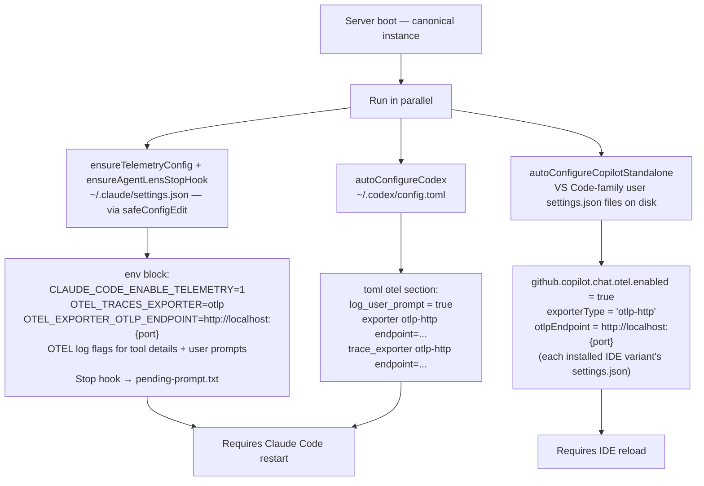

---

## 13. Build Pipeline

Four independent esbuild targets produce four output bundles.

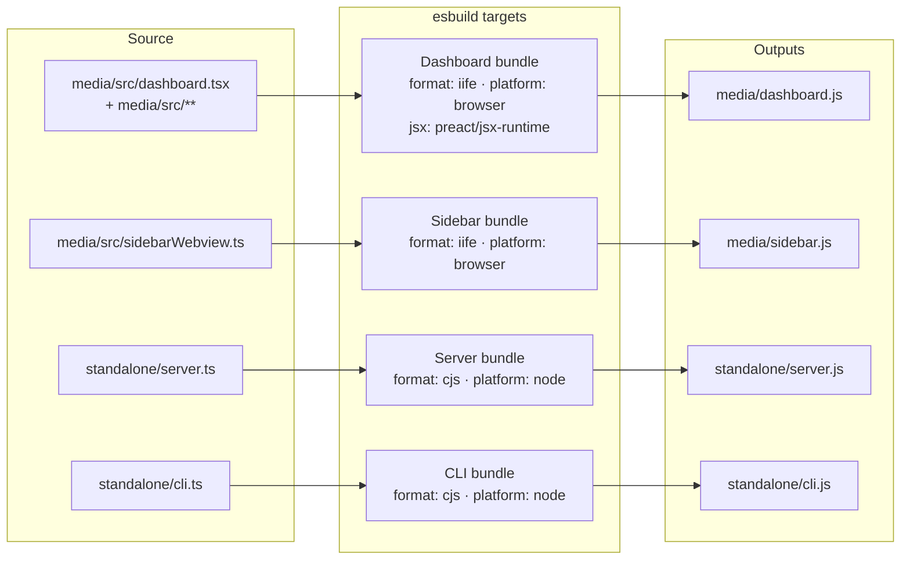

`sql.js` is not bundled: the standalone server resolves it from `node_modules` at runtime (`require.resolve('sql.js')` + `locateFile` for its WASM, `standalone/server.ts`) and uses it to read OpenCode's SQLite database — when `sql.js` is unavailable, OpenCode ingestion falls back to the per-message JSON files.

### Type-check vs bundle

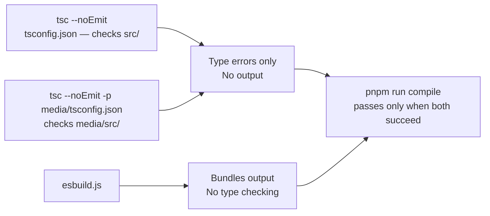

---

## File Map

```text
agentlenspro/
├── src/
│   ├── otlpCollector.ts          # HTTP server, Codex session synthesis
│   ├── otlpParser.ts             # Pure parsing (tests/standalone)
│   ├── sessionStore.ts           # 5-min rolling span window, onUpdate callbacks
│   ├── sessionRepository.ts      # Merges DB + live window; single session data access point
│   ├── spanSummarizer.ts         # Orchestrates per-agent builders
│   ├── segmentedSpanStore.ts     # Standalone span persistence — daily append-only NDJSON segments,
│   │                             #   per-segment index, range loads, retention, spans.json migration
│   ├── shared/                   # Runtime-neutral modules imported by BOTH src/** and media/src/**
│   │   │                         #   (no Node imports, no DOM APIs; guarded by scripts/check-no-mirrors.js)
│   │   ├── pricing.ts            # THE rate table: lookupRates, calcTokenCostUsd (host), calcTokenCost (webview)
│   │   ├── summarizerTypes.ts    # SessionSummaryCard, TimelineEntry, and all card/diagnosis types
│   │   ├── telemetryTypes.ts     # Span, SpanAttribute, SpanStatus, LoopSignal(Type)
│   │   ├── cacheBreak.ts         # Cache-break classifier + report builder + CAUSE_LABEL
│   │   ├── keepWarm.ts           # Keep-warm / cache-gap diagnostic (TtlRegime-aware, computeKeepWarm)
│   │   ├── cacheTtl.ts           # The doc-verified prompt-cache TTL matrix (regime × auth × env → ttlMs)
│   │   ├── tokenBuckets.ts       # Disjoint four-bucket normalization (disjointBuckets, contextTokens)
│   │   ├── fallbackCounters.ts   # Parse-fallback counters (mass-corruption visibility)
│   │   ├── residentCost.ts       # Resident-cost itemization over a ContextHistory
│   │   ├── spawnRollup.ts        # Spawn-cost rollup + antipattern detections
│   │   └── tokensByCause.ts      # Tokens-by-cause attribution rollup
│   ├── autoConfigNode.ts         # Claude/Codex file-based config
│   ├── exportData.ts             # JSON export helpers
│   ├── logReader.ts              # LogReader — local log ingestion (Claude/Codex/Copilot CLI/Copilot Chat JSONL+JSON)
│   ├── loopDetector.ts           # Loop signal detection
│   ├── types.ts                  # Host-only types (SessionSummary)
│   ├── database/
│   │   ├── schema.ts             # SCHEMA_SQL — CREATE TABLE statements + indexes
│   │   ├── db.ts                 # AgentLensDb — open, migrate, save, dispose
│   │   ├── writer.ts             # DatabaseWriter — enqueue/drain, blob writes, cost_usd
│   │   ├── reader.ts             # DatabaseReader — list, search, analytics, burn rate, blobs
│   │   ├── migration.ts          # migrateGlobalStateToSqlite (one-time)
│   │   ├── retention.ts          # runRetention — DELETE old sessions + blob eviction
│   │   └── types.ts              # Shared DB types
│   ├── summarizers/
│   │   ├── claude.ts             # Claude Code session builder
│   │   ├── copilot.ts            # Copilot session builder
│   │   ├── codex.ts              # Codex session builder
│   │   └── helpers.ts            # Shared attribute/token extraction
│   └── test/
│       ├── sessionStore.test.ts
│       ├── database/
│       │   ├── writer.test.ts
│       │   ├── reader.test.ts
│       │   ├── reader.analytics.test.ts
│       │   ├── migration.test.ts
│       │   ├── retention.test.ts
│       │   └── sessionRepository.test.ts
│       └── pricing.test.ts
├── media/
│   ├── src/
│   │   ├── App.tsx               # Preact root, message handler, tab router, sticky tab bar
│   │   ├── state.ts              # Signals: sessions, timelines, blobs, analytics, sort, time range
│   │   ├── types.ts              # Webview-specific message/UI types + re-exports of src/shared types
│   │   ├── sessionMetrics.ts     # calcSessionCost, calcEntryCost, fmtUsd
│   │   ├── utils.ts              # Formatting helpers, agent colors, session labels
│   │   ├── agentProfiles.ts      # Per-agent alert/automation thresholds (localStorage)
│   │   ├── AgentThresholdInputs.tsx  # Reusable form input components for threshold editing
│   │   ├── sidebarWebview.ts     # Sidebar JS (no JSX)
│   │   ├── styles/
│   │   │   ├── base.css          # Global variables, layout primitives
│   │   │   ├── tabs.css          # Tab bar (sticky), tab-mini buttons
│   │   │   ├── toolbar.css       # Time range picker, agent filter pills, search bar
│   │   │   ├── components.css    # Cards, tables, tool-insights-table, empty states
│   │   │   ├── tooltip.css       # has-metric-tip, metric-tooltip (global hover tooltip)
│   │   │   ├── waterfall.css     # Trace waterfall timeline
│   │   │   ├── summaries.css     # Session detail expand: sw-detail, sw-bg-* blocks
│   │   │   ├── heatmap.css       # heatmap-axis-label used by Cost/Efficiency charts
│   │   │   ├── insights.css      # InsightCard styles
│   │   │   ├── graph.css         # Flow semantic graph canvas overlay
│   │   │   ├── help.css          # Help tab typography, TOC nav, glossary
│   │   │   └── export.css        # Export tab card layout
│   │   └── tabs/
│   │       ├── Sessions.tsx      # Sortable session table, expand-in-place detail panel
│   │       │                     #   sub-tabs: Overview (InsightCards) · Trace · Flow · Tools · Files
│   │       ├── Analytics.tsx     # ESTIMATED COST · AGENT BREAKDOWN · TOKEN USAGE · CONTEXT GROWTH
│   │       ├── Insights.tsx      # InsightCard component + generateInsights; clipboard copy icon
│   │       ├── Cost.tsx          # CostBarChart (canvas), per-session cost table, M/K token toggle, CSV export, fmtUsd
│   │       ├── SessionCharts.tsx # ContextGrowthChart (animated), SessionTokenChart, TurnsLink
│   │       ├── Traces.tsx        # Waterfall rows (Step/StepRow), background span groups
│   │       ├── Flow.tsx          # Turn-to-tool semantic graph (canvas), FlowCanvas component
│   │       ├── Agents.tsx        # computeStats helper used by Analytics AgentCard
│   │       ├── Tools.tsx         # ToolsChart (donut + table) used by Sessions detail
│   │       ├── Alerts.tsx        # Alert config UI, checkAlerts, AlertNotification type
│   │       ├── Automation.tsx    # Automation config UI, checkAutomations, prompt building
│   │       ├── Export.tsx        # Raw + redacted JSON export UI
│   │       └── Help.tsx          # Sticky TOC nav, glossary, OTEL setup guide
│   ├── dashboard.js              # Compiled Preact bundle
│   ├── dashboard.css             # Compiled styles
│   └── sidebar.js                # Compiled sidebar script
├── standalone/
│   ├── server.ts                 # Standalone HTTP server (no VS Code)
│   └── cli.ts                    # The ONE executable: `agentlenspro` — thin shim over src/cli/main.ts
├── src/cli/                      # The single-executable dispatcher (TRDD-7284WCW7)
│   ├── main.ts                   # Top-level dispatch: --version/--help fast paths, subcommand routing
│   ├── diagnosticsCli.ts         # 32 diagnostic tools + ops flags (schemas live from the server)
│   ├── serverControl.ts          # server start|stop|restart|status [--supervise], dashboard
│   ├── hookHandlers.ts           # `agentlenspro hook` / `agentlenspro gate` stdin handlers
│   ├── hookInstall.ts            # hook/OTEL/skill (un)installers + registration migration
│   ├── heartbeatCostCli.ts       # `agentlenspro heartbeat-cost`
│   ├── configCli.ts              # `agentlenspro config` — retention knobs (TRDD-ZAV74M8Q)
│   ├── envCli.ts                 # `agentlenspro env` — environment/system detection (TRDD-HUWJVQJA)
│   ├── setup.ts                  # `agentlenspro setup` — detect → converge → verify-per-step → self-test
│   └── cliCore.ts                # shared JSON-RPC/REST transport + endpoint/env resolution
├── src/environment/             # `agentlenspro env` facet registry (TRDD-HUWJVQJA) — all fail-soft,
│   │                            #   pure classifiers + async gather(), no server, injectable for tests
│   ├── types.ts                  # the EnvFacet contract + EnvReport
│   ├── exec.ts                   # fail-soft time-boxed run()/which()/toolVersion() helpers
│   ├── index.ts                  # the facet REGISTRY + gatherAll() (runs facets concurrently)
│   ├── terminal.ts               # terminal kind by PROCESS ANCESTRY + ai-maestro/tmux/ssh
│   ├── os.ts · runtime.ts · claude.ts · filesystem.ts · user.ts
│   └── network.ts · cloud.ts · tooling.ts · mcp.ts
├── src/retentionConfig.ts       # persistent retention config layer (TRDD-ZAV74M8Q)
├── scripts/
│   └── safe_config_edit.py       # Verified-transaction config editor (backup, verify-diff, lock)
├── esbuild.js                    # Build configuration (4 targets)
├── package.json                  # npm package manifest — bins, scripts, dependencies
└── ARCHITECTURE.md               # This file
```
